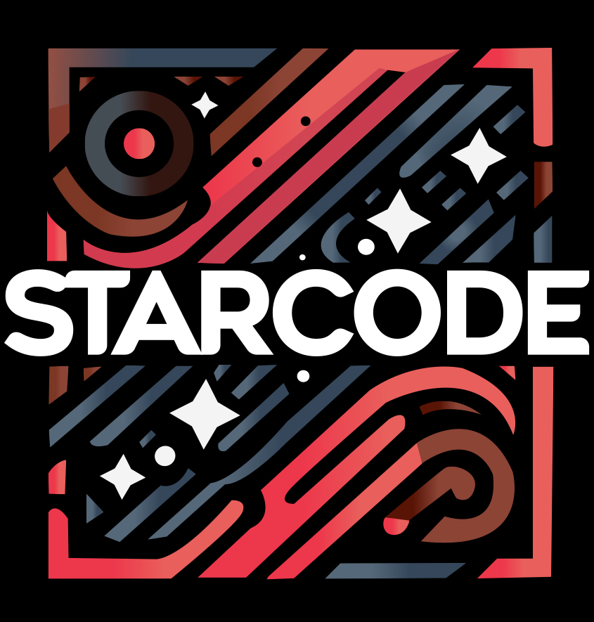

<div align="center">

#  StarCode Extension Pack

**Essential extensions, settings, snippets and fonts for VS Code, Cursor and Windsurf**

[](https://marketplace.visualstudio.com/items?itemName=dmitriy-iskenderov.starcode)
[](LICENSE.md)
[](https://code.visualstudio.com/)

</div>

---

## ✨ Features

- 🎁 **Extension Pack** - Automatically installs essential extensions
- 💡 **Recommended Extensions** - Suggests additional useful extensions  
- ⚙️ **Pre-configured Settings** - Optimized VS Code settings for development
- 📝 **Custom Snippets** - Ready-to-use code snippets for React, JavaScript, TypeScript, HTML, CSS, and SCSS
- ⌨️ **Key Bindings** - Custom keyboard shortcuts (F3 for Format Document)
- 🔤 **Font Installation** - Optional JetBrains Mono font installation

---

## 📦 Included Extensions (Primary)

These extensions are automatically installed when you install the pack:

| Extension | Description |
|-----------|-------------|
|  **[Prettier](https://marketplace.visualstudio.com/items?itemName=esbenp.prettier-vscode)** | Code formatter |
|  **[ESLint](https://marketplace.visualstudio.com/items?itemName=dbaeumer.vscode-eslint)** | JavaScript linter |
|  **[Live Server](https://marketplace.visualstudio.com/items?itemName=ritwickdey.LiveServer)** | Local development server |
| 🔧 **[eCSStractor](https://marketplace.visualstudio.com/items?itemName=diz.ecsstractor-port)** | CSS extraction tool |
| 🏷️ **[htmltagwrap](https://marketplace.visualstudio.com/items?itemName=bradgashler.htmltagwrap)** | HTML tag wrapper |
| \` **[Backticks](https://marketplace.visualstudio.com/items?itemName=fractalbrew.backticks)** | Template string helper |
| 🎨 **[Material Icon Theme](https://marketplace.visualstudio.com/items?itemName=PKief.material-icon-theme)** | File icons |
| 🔤 **[Google Fonts](https://marketplace.visualstudio.com/items?itemName=lior-chamla.google-fonts)** | Font preview |
| 📁 **[Path Intellisense](https://marketplace.visualstudio.com/items?itemName=christian-kohler.path-intellisense)** | Path autocomplete |

---

## 💡 Recommended Extensions

These extensions are suggested but not automatically installed:

| Extension | Description |
|-----------|-------------|
| 🎨 **[Tailwind CSS IntelliSense](https://marketplace.visualstudio.com/items?itemName=bradlc.vscode-tailwindcss)** | Tailwind CSS autocomplete |
| 🌊 **[Headwind](https://marketplace.visualstudio.com/items?itemName=heybourn.headwind)** | Tailwind class sorter |
| 🐛 **[Pretty TypeScript Errors](https://marketplace.visualstudio.com/items?itemName=yoavbls.pretty-ts-errors)** | Better TypeScript error messages |
| 🌟 **[The Best Theme](https://marketplace.visualstudio.com/items?itemName=kohlbachjan.the-best-theme)** | Beautiful theme |
| 🤖 **[GitHub Copilot](https://marketplace.visualstudio.com/items?itemName=github.copilot)** | AI pair programmer |
| 🎨 **[codeSTACKr Theme](https://marketplace.visualstudio.com/items?itemName=codestackr.codestackr-theme)** | Modern theme |
| 📐 **[Sort CSS](https://marketplace.visualstudio.com/items?itemName=piyushsarkar.sort-css-properties)** | CSS property sorter |
| 🔐 **[DOTENV](https://marketplace.visualstudio.com/items?itemName=mikestead.dotenv)** | .env file support |

---

## 🚀 Installation

### From VSIX file

1. Download the `.vsix` file
2. Open **VS Code** / **Cursor** / **Windsurf**
3. Go to **Extensions** (`Ctrl+Shift+X` / `Cmd+Shift+X`)
4. Click **"..."** → **"Install from VSIX..."**
5. Select the `.vsix` file

### Build from source

```bash
# Clone the repository
git clone <repository-url>
cd vscode_pack

# Install dependencies
npm install

# Generate package.json
npm run build

# Compile TypeScript
npm run compile

# Create .vsix file
npm run create-vsix
```

---

## 📖 Usage

### 🔤 Font Installation

On first activation, you'll be prompted to install **JetBrains Mono** fonts. You can also install them manually:

1. Press `Ctrl+Shift+P` (or `Cmd+Shift+P` on Mac)
2. Type **"Install JetBrains Mono Fonts"**
3. Press Enter

### 📝 Snippets

The extension includes custom snippets for:

- ⚛️ **React** - Components and hooks (`rfc`, `rafc`, `sta`, `eff`, etc.)
- 💻 **JavaScript/TypeScript** - Functions and utilities (`arf`, `iife`, `cl`, etc.)
- 🌐 **HTML** - Swiper slider templates (`swiper`, `swiperfull`)
- 🎨 **CSS/SCSS** - Media queries, pseudo-classes, transforms (`md`, `hv`, `ba`, etc.)

**Usage:** Type the snippet prefix and press `Tab` to expand.

### ⌨️ Key Bindings

| Key | Action |
|-----|--------|
| `F3` | Format Document |

---

## ⚙️ Configuration

All settings are pre-configured with optimal defaults:

### Prettier Settings
- **Tab Width:** 3 spaces
- **Print Width:** 120 characters
- **Single Quotes:** Enabled
- **Trailing Commas:** All
- **Semicolons:** Disabled
- **Use Tabs:** Enabled

### Editor Settings
- **Font:** JetBrains Mono
- **Tab Size:** 3
- **Smooth Scrolling:** Enabled
- **Scrollbars:** Hidden
- **Format on Save:** Enabled
- **Format on Paste:** Enabled

### ESLint Settings
- **Auto-fix on Save:** Enabled
- **Validate:** JavaScript, TypeScript, HTML, CSS, SCSS

You can customize these settings in VS Code settings (`Ctrl+,`).

---

## 🔧 Adding/Updating Extensions

1. Edit `config/extensions.json`
2. Add extension IDs to `primary` or `secondary` arrays
3. Run `npm run build` to regenerate `package.json`
4. Update version in `package.json` if needed
5. Run `npm run create-vsix` to create new `.vsix` file

**Example:**
```json
{
  "primary": ["extension-id-1", "extension-id-2"],
  "secondary": ["extension-id-3", "extension-id-4"]
}
```

---

## 💻 Compatibility

- ✅ **VS Code** 1.60.0+
- ✅ **Cursor** (all versions)
- ✅ **Windsurf** (all versions)

---

## 📄 License

This project is licensed under the MIT License - see the [LICENSE.md](LICENSE.md) file for details.

---

## 👤 Author

**Dmitriy Iskenderov**

Developed and maintained by **StarCode School**

---

<div align="center">

Made with ❤️ by [StarCode School](https://starcode.school)

[⬆ Back to Top](#-starcode-extension-pack)

</div>
